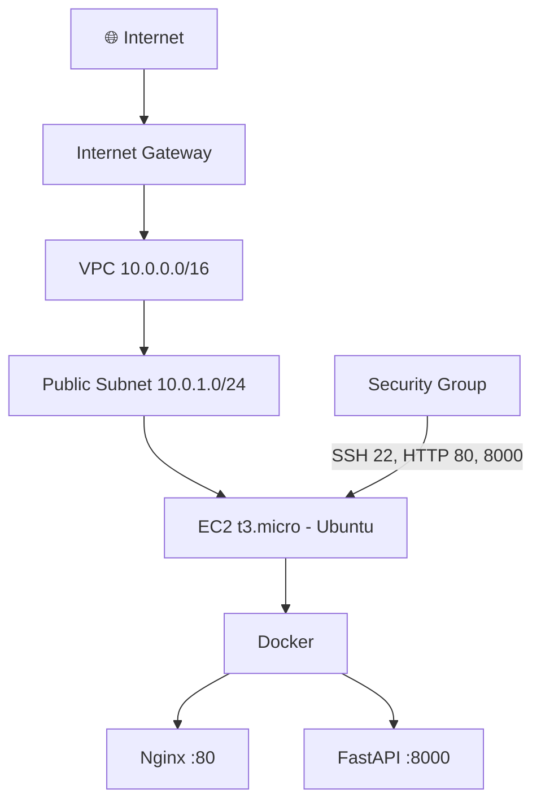

# ☁️ AWS Terraform Lab

Infrastructure as Code (IaC) project — Deploy a production-like FastAPI application on AWS using Terraform.


## 📈 Results

| Metric | Value |
|--------|-------|
| Deployment time | terraform apply → **full stack in <5 min** |
| Monthly cost | **~\** (free tier eligible) / ~\ after |
| Infrastructure | VPC + Subnet + SG + EC2 + Docker + Nginx + FastAPI |
| Reproducibility | Destroy and recreate identical infra in minutes |
| Security | SSH restricted to allowed CIDR, no secrets in code |
| CI validation | terraform fmt + validate on every push |

---
## 🏗️ Architecture

```
┌─────────────────────────────────────────────────┐
│                    AWS Cloud                     │
│  ┌─────────────────────────────────────────┐    │
│  │           VPC (10.0.0.0/16)             │    │
│  │  ┌──────────────────────────────────┐   │    │
│  │  │    Public Subnet (10.0.1.0/24)   │   │    │
│  │  │                                  │   │    │
│  │  │  ┌────────────────────────┐      │   │    │
│  │  │  │   EC2 (t3.micro)      │      │   │    │
│  │  │  │  ┌──────────────────┐ │      │   │    │
│  │  │  │  │ Docker           │ │      │   │    │
│  │  │  │  │  ├── Nginx :80   │ │      │   │    │
│  │  │  │  │  └── FastAPI:8000│ │      │   │    │
│  │  │  │  └──────────────────┘ │      │   │    │
│  │  │  └────────────────────────┘      │   │    │
│  │  └──────────────────────────────────┘   │    │
│  │              ↕ Internet Gateway          │    │
│  └─────────────────────────────────────────┘    │
└─────────────────────────────────────────────────┘
         ↕




    🌐 Internet → http://PUBLIC_IP
```

## 📁 Project Structure

```
aws-terraform-lab/
├── main.tf                    # VPC + Subnet + SG + EC2
├── variables.tf               # Input variables
├── outputs.tf                 # Output values (IP, URL)
├── terraform.tfvars.example   # Config template
├── scripts/
│   └── user_data.sh           # EC2 bootstrap (Docker + FastAPI + Nginx)
├── .gitignore
└── README.md
```

## 🚀 Quick Start

### Prerequisites
- [Terraform](https://terraform.io) >= 1.5
- AWS account + CLI configured
- SSH key pair in target region

### Deploy

```bash
# 1. Clone
git clone https://github.com/DerbSwag/aws-terraform-lab.git
cd aws-terraform-lab

# 2. Configure
cp terraform.tfvars.example terraform.tfvars
# Edit terraform.tfvars with your values

# 3. Deploy
terraform init
terraform plan
terraform apply
```

### Access

```bash
# Get the app URL
terraform output app_url

# SSH into instance
ssh -i your-key.pem ubuntu@$(terraform output -raw instance_public_ip)
```

### Destroy

```bash
terraform destroy
```

## ⚙️ What Gets Created

| Resource | Details |
|----------|---------|
| **VPC** | 10.0.0.0/16 with DNS support |
| **Public Subnet** | 10.0.1.0/24 with auto-assign public IP |
| **Internet Gateway** | Full internet access |
| **Security Group** | SSH (22) + HTTP (80) + FastAPI (8000) |
| **EC2 Instance** | Ubuntu 24.04, t3.micro, 20GB gp3 |
| **Docker** | Auto-installed via user_data |
| **FastAPI + Nginx** | Auto-deployed via Docker Compose |

## 🔒 Security

- SSH restricted to `allowed_ssh_cidr` (configure your IP)
- No secrets in code — use `terraform.tfvars` (gitignored)
- Egress open for package installation

## 🗺️ Roadmap

- [ ] Add RDS (PostgreSQL)
- [ ] Add S3 bucket for static files
- [ ] Add ALB (Application Load Balancer)
- [ ] Add Route53 DNS
- [ ] Add Terraform remote state (S3 + DynamoDB)
- [ ] Add monitoring (CloudWatch / Prometheus)
- [ ] Multi-AZ deployment

## 📝 Part of DevOps Learning Path

This project is part of my journey from **IT Infrastructure Engineer → DevOps Engineer**.

See also:
- [DevOps FastAPI Lab](https://github.com/DerbSwag/Devops-fastapi-lab) — K8s + GitOps + Monitoring
- [IT Automation Toolkit](https://github.com/DerbSwag/IT-Automation-Toolkit) — GLPI + PowerShell

## 📄 License

MIT
